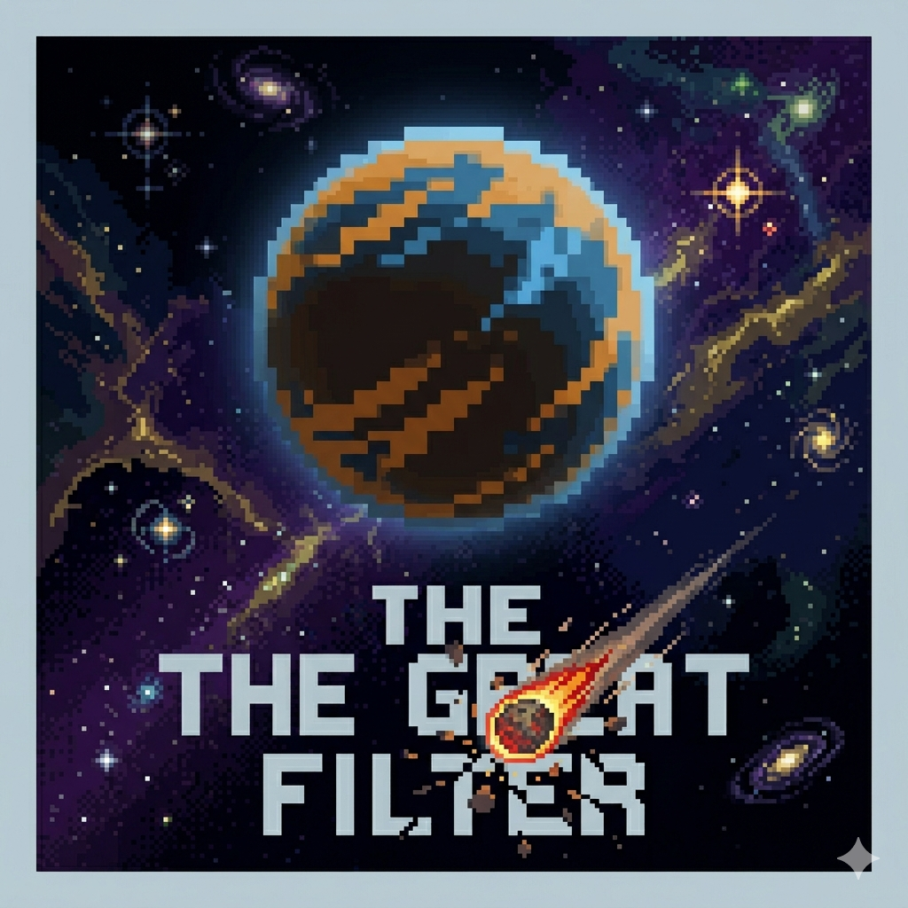

 

# THE GREAT FILTER

 

 

*The universe is vast and old.*
*Where is everybody?*

 

Six filters stand between your civilization and the stars.
Most don't make it.

 

**no hints. no tutorials. learn through loss.**

 

> *You are not supposed to know. Neither were we.*

---

Made with dread, curiosity, and respect for the silence of the universe.

