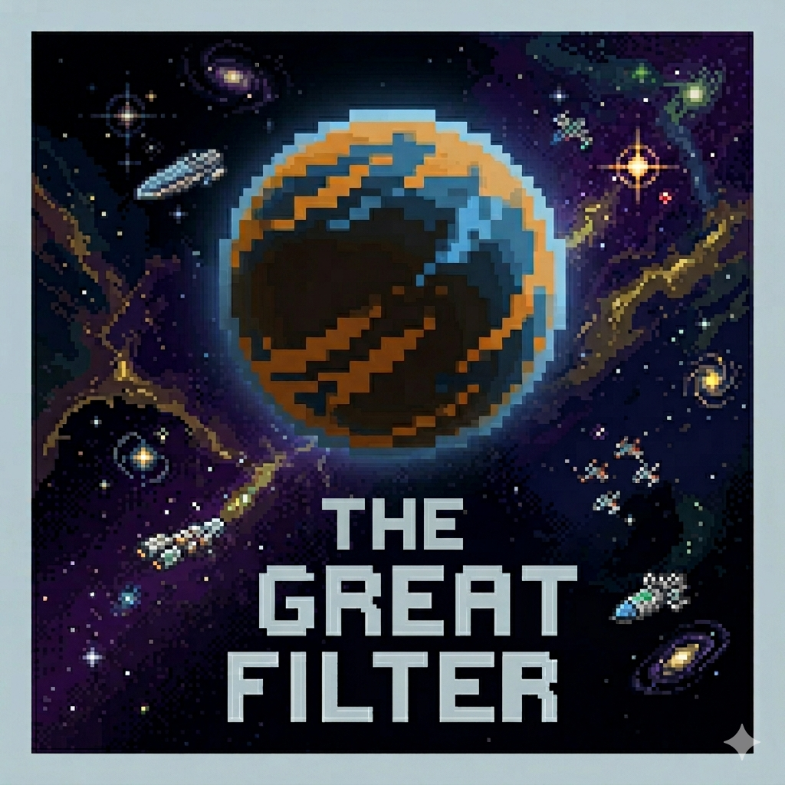

 

# THE GREAT FILTER

 

 

*The universe is vast and old.*
*Where is everybody?*

---

Somewhere between single-celled life and the stars, something kills civilizations. We don't know what it is. We don't know if it's behind us or ahead.

You manage a civilization across four fields — **Food, Energy, Science, Society**. Every second counts. Every decision is permanent. Six filters will come, each one a different kind of crisis, each one testing a different kind of wisdom.

Survive them all and the universe offers you another world.

The next world will ask more of you. You won't know exactly what. That's the point.

---

| 🦠 The Plague | ☢️ The War | 🌡️ Climate Collapse | 🤖 The Machine God | 👽 The Signal | ✨ The Great Filter |
|:-:|:-:|:-:|:-:|:-:|:-:|

*six filters. one civilization. no second chances.*

 

**no hints. no tutorials. learn through loss.**

 

> *You are not supposed to know. Neither were we.*

 

*Made with dread, curiosity, and respect for the silence of the universe.*

